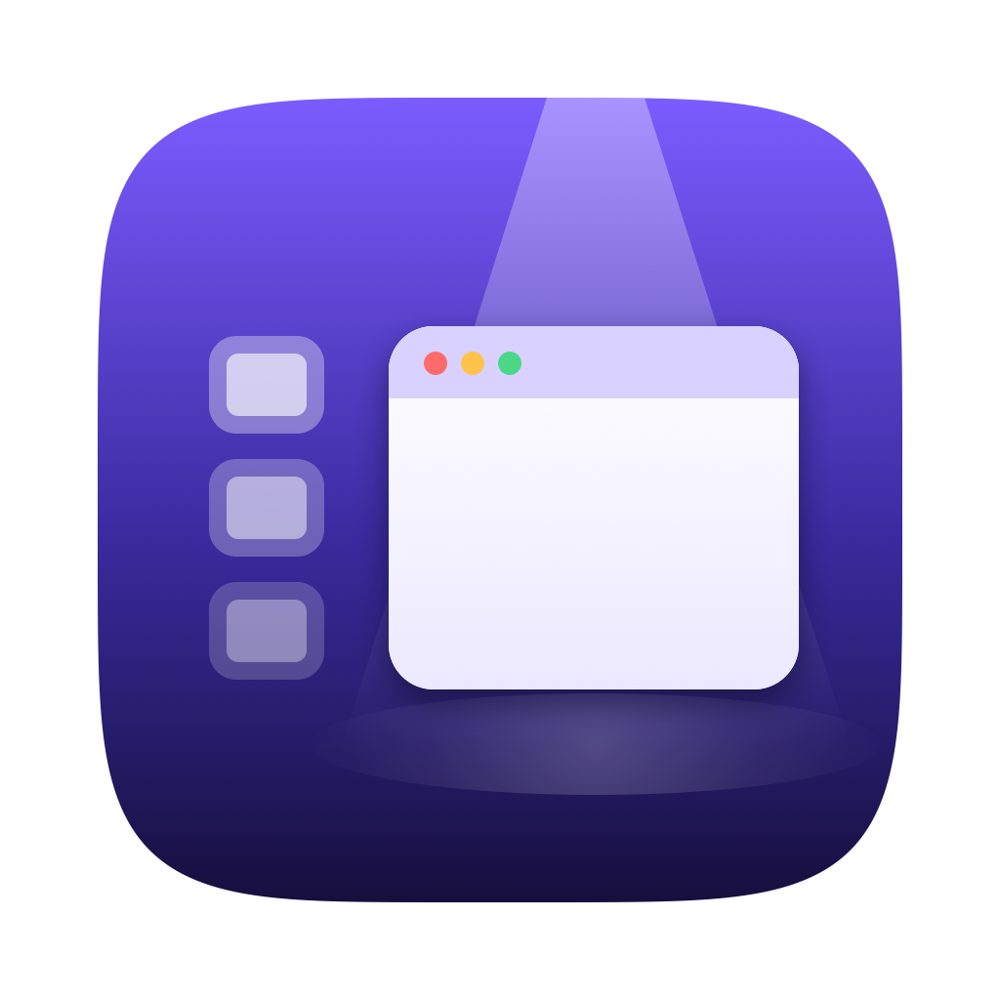

<p align="center">
  
</p>

<h1 align="center">Stage Left</h1>

<p align="center"><strong>Stage Manager for the screens you choose — and a normal desktop on the rest.</strong></p>

macOS Stage Manager is all or nothing: switch it on and every display gets it.
Stage Left gives each screen its own setting. Stage your laptop's built-in display
while the external monitor on your desk behaves like an ordinary desktop, and
flip the whole thing on or off from Control Centre.

Stage Left is a small menu bar app written in Swift. It uses no network access
and collects nothing.

> Stage Manager is a trademark of Apple Inc. Stage Left is an independent project
> and is not affiliated with or endorsed by Apple.

## Features

- **Per-screen staging.** On a staged screen, the window you are working in stays
  put and the others are tucked into a strip at the left edge. Click one to
  bring it back. Screens you have not selected are never touched.
- **Remembers each monitor.** Settings are tied to the physical display, so a
  monitor keeps its setting when you unplug and reconnect it. A monitor Stage Left
  has never seen starts unselected — handy if you move between desks.
- **Control Centre button.** One switch to turn staging on and off, in place of
  Apple's Stage Manager button (requires macOS 26 or later; see below).
- **Stays out of the way.** The strip hides when you reveal the desktop, never
  follows you onto another Space, and never floats over a full-screen app.
- **Optional Dock hiding.** Auto-hides the Dock while staging is on and puts your
  own setting back afterwards.
- **Scriptable.** Command-line options for Shortcuts and other automation.

## Requirements

- macOS 14 or later on a Mac with Apple silicon. Developed and tested on
  macOS 27 with two displays. The Control Centre button needs macOS 26 or later.
- **Accessibility permission**, which macOS asks for on first launch. Stage Left
  needs it to hide, minimise and restore other apps' windows, and uses it for
  nothing else.
- To build: Xcode Command Line Tools. The Control Centre button additionally
  needs a full Xcode.

## Install

1. Download **Stage-Left-1.0.zip** from the
   [latest release](https://github.com/ilovecocolade/stage-left/releases/latest)
   and open it to unzip.
2. Drag **Stage Left** into your **Applications** folder. The Control Centre
   button only works from there.
3. Open Stage Left. macOS blocks it the first time: open **System Settings →
   Privacy & Security**, find the message about Stage Left, click
   **Open Anyway** and confirm.
4. Grant **Accessibility** permission when macOS asks.

Releases are signed ad-hoc — anonymously — rather than with a paid Apple
Developer ID, so macOS cannot check who made the app or tell one release from
the next. That is why step 3 is needed. If you prefer Terminal, this does the
same:

```bash
xattr -dr com.apple.quarantine "/Applications/Stage Left.app"
```

It also means **Accessibility must be granted again after each update**: remove
Stage Left from System Settings → Privacy & Security → Accessibility, then add it
back.

Each release lists the zip's SHA-256 checksum. To check your download against
it:

```bash
shasum -a 256 ~/Downloads/Stage-Left-1.0.zip
```

### Build from source

```bash
git clone https://github.com/ilovecocolade/stage-left.git
cd stage-left
./build.sh
open "/Applications/Stage Left.app"
```

`build.sh` signs with the first Apple Development or Developer ID certificate in
your keychain (set `STAGELEFT_IDENTITY` to choose one), turns on the Hardened
Runtime, installs into `/Applications`, and leaves no launchable copy behind in
`build/`.

A real signing identity matters more than it looks. An ad-hoc signature changes
with every build, so macOS treats each build as a new app and silently drops the
Accessibility permission you granted. Without a certificate the app still works,
but you will have to grant the permission again after each build — and if it ever
claims to need permission you have already given, remove Stage Left from System
Settings → Privacy & Security → Accessibility and add it again.

`./build.sh --package` builds a release download instead of installing. It
signs ad-hoc, since a development certificate would name its owner in every
copy; strips debug information, which records the folder it was built in; and
writes the zip and its checksum to `build/release`. It needs a full Xcode.

## Using it

Open Stage Left and tick the screens to stage. From then on:

| Where | What |
|---|---|
| Menu bar icon | Master switch, screen list, bring back all windows, settings |
| Settings window | Everything above, plus Dock hiding, menu bar icon, open at login |
| Control Centre | The master switch, once added (below) |
| `⌥⌘1` … `⌥⌘9` | Stage or release that screen |
| `⌥⌘S` | Bring back every tucked window |

Opening Stage Left while it is running brings up its settings, and so does the
small gear at the foot of the strip. Either way gets you back to them if you hide
the menu bar icon.

Stage Left turns off Apple's own Stage Manager when you ask it to, and warns you
if it is on, since the two fight over the same windows.

### The Control Centre button

Open Control Centre, click **Edit Controls**, remove **Stage Manager** and add
**Stage Left**. Turn on **Open at Login** as well: the button only works while the
app is running, and shows off when it is not. The button is a single on/off switch; which screens it applies to
is chosen in the app.

### From the command line

```bash
"/Applications/Stage Left.app/Contents/MacOS/StageLeft" --toggle
```

| Option | Effect |
|---|---|
| `--on` | Stage the built-in screen only; release every external screen |
| `--off` | Stop staging everywhere and bring every window back |
| `--toggle` | Switch between the two |
| `--status` | Print the current state |
| `--unhide-all` | Unhide every hidden app — a way out if windows ever go missing |

`--on` writes the whole preset each time rather than remembering it, so it lands
the same way whatever monitor is plugged in. Put it in a Shortcut to drive
Stage Left from anywhere.

## Privacy

Stage Left makes no network connections and has no analytics. It stores its
settings in its own preferences and a lock file in
`~/Library/Application Support/Stage Left`. It changes
two system settings, and only when asked: Apple's Stage Manager switch (when you
tell it to turn Stage Manager off) and the Dock's auto-hide (when "Hide the Dock
while staging" is on — your own value is saved and put back).

## How it works

These notes record what does and does not work on current macOS. Most of it was
found the hard way.

### Why not just use Apple's Stage Manager?

There is no per-display state to use. The `com.apple.WindowManager` preferences
hold one `GloballyEnabled` boolean, WindowManager only ever calls
`setStageManagerGloballyEnabled`, and its client API can only report an app's own
windows. So Stage Left turns Apple's version off and stages windows itself, using
the Accessibility API.

### Tucking windows away

Two mechanisms, chosen per app:

- **Hiding the app** — instant, no animation. Used when every one of the app's
  windows is on the staged screen and none of them is staying on stage.
- **Minimising the window** — costs the Dock animation, so it is the fallback
  for apps with windows on several screens. Switching the Dock's minimise effect
  to Scale in System Settings makes it quicker.

Tried and rejected:

- **Moving windows off-screen.** macOS clamps the move so about 40 points stay
  visible; it will not let a window be lost.
- **The window server's own move.** `SLSMoveWindow` returns error 1000 for
  another app's windows.
- **Zero alpha.** `SLSSetWindowAlpha` works across processes, but an invisible
  window still takes clicks, and would be unrecoverable if Stage Left died.

Both mechanisms in use leave windows reachable from the Dock, so nothing can be
lost. `NSRunningApplication.hide()` and `unhide()` report `false` even when they
work, so Stage Left checks the real state afterwards, retries, and as a last
resort activates the app, which always brings it back into view.

### Never losing an app

A hidden app that falls out of Stage Left's records becomes invisible to
everything: the strip does not list it, the window scanner skips hidden apps, and
nothing is left to unhide it. So Stage Left keeps a separate ledger, written
straight to disk, of every app it has hidden, and on every pass brings back
anything in it that it no longer accounts for. A crash is undone at the next
launch. Apps you hide yourself with ⌘H are not in the ledger and are left alone.

### Choosing what stays on stage

Turning staging on takes effect at once on every selected screen, without waiting
for a click. Each screen keeps whatever it was last used for; on a screen
Stage Left has not seen used, it keeps the frontmost window, which the window
server already tracks in stacking order. Windows brought back any other way —
the Dock, ⌘-Tab, Mission Control — drop out of the strip too.

### The strip and Spaces

The strip panel is deliberately not `.canJoinAllSpaces`, `.fullScreenAuxiliary`
or `.stationary`. The first two carried it onto every Space, including
full-screen apps; the last pinned it in place while a desktop reveal swept the
real windows away. On top of that it only shows while the window it is staged
around is on the Space in front of you.

A full-screen app is never treated as a stage: swiping to one makes it the
frontmost window on its display, which would otherwise make Stage Left adopt it.
Full screen is detected by asking the window (`AXFullScreen`) rather than
measuring it — on a notched display a full-screen window does not cover the menu
bar area, so it is never quite screen-sized.

### One copy at a time

Two copies of Stage Left, even from different folders, share preferences and fight
over the same windows, each drawing its own strip on top of the other's. The app
holds an exclusive `flock` for its lifetime; a second launch hands over to the
running copy and exits. The kernel releases the lock when the process ends, so a
crash cannot leave it stuck. Command-line options do not take the lock.

### Hiding the Dock

macOS 27 offers another app no live way to change Dock auto-hide: the private
CoreDock calls are gone, System Events accepts `set autohide of dock preferences`
but changes nothing, a synthesised ⌥⌘D has no effect, and the Dock does not
reload the preference by itself. It does read it on startup, so Stage Left writes
the setting and restarts the Dock, which blinks for about a second.

### Building the Control Centre button without an Xcode project

`build.sh` builds the WidgetKit extension by hand when a full Xcode is present
(it checks `DEVELOPER_DIR`, `Xcode.app`, then `Xcode-beta.app`). Every one of
these was needed, and most fail silently:

- **`appintentsmetadataprocessor` (Xcode only) must produce
  `Metadata.appintents`.** Without it the extension registers but never appears
  in the Control Centre gallery. The Swift compile needs `-wmo`, or no
  `.swiftconstvalues` file is written for the processor to read.
- **Link with `-e _NSExtensionMain`**, as Xcode does for every app extension.
  Otherwise Swift's `@main` runs instead of the extension runtime and
  ExtensionKit traps the moment launchd starts it, logging nothing.
- **Install to `/Applications`.** From `~/Applications` the extension is
  registered but the widget daemon never launches it.
- **Sandbox the extension.** Without the sandbox entitlement macOS will not
  register it.
- **Reach the app through Darwin notifications, not an app group.** The
  sandboxed extension cannot read the app's preferences. An app group would
  share them, but only between apps signed by a paid developer team: signed
  ad-hoc, the app's writes fail and the extension reads nothing. Instead the app
  publishes the switch as a notification's state (`notify_set_state`), which the
  extension reads instantly, and the extension posts a request to change it.
  notifyd drops the state when the app quits, so the button then reads off.

### Guarding the Accessibility permission

Stage Left needs Accessibility permission to control other apps' windows, which
makes it worth borrowing: another program running as you, without that
permission, could try to get Stage Left to act for it. Two things stop that.

- **The Hardened Runtime is on.** Without it, launching the app with
  `DYLD_INSERT_LIBRARIES` would load arbitrary code inside it, and that code would
  inherit the permission. `build.sh` signs the app and the Control Centre button
  with `--options runtime`, and neither has an entitlement that loosens it.
- **Release builds take no instructions from their environment.** The
  diagnostics below are driven by environment variables, which whoever launches
  the app controls, and some of them read window titles or un-minimise and hide
  other apps' windows. They are compiled into debug builds only.

## Diagnostics

These exist in **debug builds only**. Build one with
`STAGELEFT_CONFIGURATION=debug ./build.sh`, then launch the binary directly with
one of the variables set; output goes to standard error.

```bash
STAGELEFT_DEBUG=1 "/Applications/Stage Left.app/Contents/MacOS/StageLeft"
```

A debug build lets anything that can launch the app drive these hooks — reading
every window title, for one — so build one to investigate a problem, then go back
to a release build with a plain `./build.sh`.

| Variable | What it does |
|---|---|
| `STAGELEFT_DEBUG=1` | Reports the menu bar item, permissions and screens |
| `STAGELEFT_SELFTEST=1` | Dry run: what would be staged, moving nothing |
| `STAGELEFT_LIVETEST=1` | Stages a real screen for a moment, then restores it |
| `STAGELEFT_FSTEST=1` | Lists windows macOS reports as full screen |
| `STAGELEFT_STRIPDUMP=1` | Reports every strip tile's icon and opacity every 2s |
| `STAGELEFT_STRANDTEST=A,B` | Fault injection: hides app A (recorded) and B (not), then exits without cleaning up |
| `STAGELEFT_RESCUE=list` | Lists every minimised window |
| `STAGELEFT_RESCUE=all` | Un-minimises every window |

Quit the running copy first, or the second launch will hand over to it.

## Project layout

| Path | Responsibility |
|---|---|
| `Sources/StageLeft/StageEngine.swift` | Decides what stays on stage and what is tucked |
| `Sources/StageLeft/WindowScanner.swift` | Finds windows, stacking order, full-screen displays |
| `Sources/StageLeft/AXObserverCenter.swift` | Watches every app for window activity |
| `Sources/StageLeft/Accessibility.swift` | Wrappers over the Accessibility API |
| `Sources/StageLeft/Geometry.swift` | The AppKit ↔ Accessibility coordinate flip |
| `Sources/StageLeft/Display.swift` | Screens, identified by stable UUID |
| `Sources/StageLeft/Preferences.swift` | Per-screen and app settings |
| `Sources/StageLeft/StripController.swift` | The strip of tucked windows |
| `Sources/StageLeft/MenuController.swift` | Menu bar item, hotkeys and app wiring |
| `Sources/StageLeft/SettingsWindow.swift` | The settings window |
| `Sources/StageLeft/SharedState.swift` | The master switch, and how the Control Centre button reaches it |
| `Sources/StageLeft/CommandLineInterface.swift` | `--on`, `--off`, `--toggle` and friends |
| `Sources/StageLeft/SingleInstance.swift` | Only one copy runs at a time |
| `Sources/StageLeft/DockAutohide.swift` | Optional Dock hiding |
| `Sources/StageLeft/StageManager.swift` | Reads and turns off Apple's Stage Manager |
| `Sources/StageLeft/HotKeyCenter.swift` | Global shortcuts, no extra permission needed |
| `Sources/StageLeft/*Test.swift`, `Rescue.swift`, `FullScreenSurvey.swift` | Diagnostics above |
| `Extension/` | The Control Centre button |
| `Tools/make-icon.swift` | Draws the app icon: `swift Tools/make-icon.swift` |

## Licence

MIT — see [LICENSE](LICENSE).
